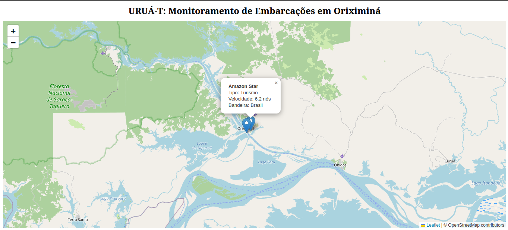

# URUÁ-T: Sistema de Monitoramento de Embarcações

O URUÁ-T é uma aplicação web desenvolvida com o objetivo de melhorar a visibilidade e a comunicação no transporte fluvial, especialmente em regiões ribeirinhas como Oriximiná (PA).

A proposta do sistema é permitir o acompanhamento de embarcações em um mapa interativo, contribuindo para uma melhor organização do transporte, apoio à logística local e maior acesso à informação pelas comunidades.

## Tecnologias utilizadas

- Python
- FastAPI
- HTML, CSS e JavaScript (Vanilla)
- Leaflet (mapas interativos)
- Uvicorn
- Google Fonts (Inter)

## Funcionalidades

- Visualização de embarcações em tempo quase real (atualização a cada 5s)
- Mapa interativo com tema escuro (dark mode)
- Navbar com indicador de status ao vivo e countdown de atualização
- Sidebar com lista de embarcações e filtros por tipo (Transporte, Turismo, Pesca, Carga)
- Ícones customizados por tipo de embarcação
- Rastro de posições (trail) para visualizar o histórico de movimentação
- Popups informativos estilizados
- Toasts de alerta para erros de conexão com a API
- Interface responsiva para dispositivos móveis
- Simulação de movimentação das embarcações via backend

## Estrutura do Projeto

```
urua-t/
├── backend/            # API FastAPI (Python)
├── database/           # Scripts SQL (PostgreSQL)
├── docs/               # Diagramas e documentação
├── frontend/static/    # Interface do usuário (HTML/CSS/JS)
├── venv/               # Ambiente virtual Python
└── README.md
```

## Banco de Dados

O projeto utiliza um banco de dados relacional (PostgreSQL) para gerenciar as informações de usuários, operadores, embarcações e histórico de localizações.

- **Schema**: Localizado em `database/schema.sql`.
- **Dados de Teste**: Exemplos de inserção e consultas em `database/seed.sql`.
- **Modelagem**: O Diagrama de Entidade-Relacionamento (DER) está disponível em `docs/diagrama_ER.png`.

## Como executar o projeto

1. Clone o repositório:
```bash
git clone https://github.com/Nalrad/radar-uruat
cd urua-t
```

2. Configure o banco de dados (PostgreSQL):
- Execute o script `database/schema.sql` para criar a estrutura das tabelas.
- Opcionalmente, use `database/seed.sql` para carregar dados de teste.

3. Ative o ambiente virtual e inicie o backend:
```bash
cd backend
source ../venv/bin/activate
uvicorn main:app --reload
```

4. Acesse no navegador:
```
http://127.0.0.1:8000/static/index.html
```

## Documentação

Os diagramas do projeto podem ser encontrados na pasta `/docs`:
- **Diagrama ER**: `docs/diagrama_ER.png`
- **Casos de Uso**: `docs/diagrama_caso_uso.png`
- **Diagrama de Classes**: `docs/diagrama_classes.png`
- **Mapa Conceitual**: `docs/mapa_conceitual.png`

## Objetivo do projeto

Este projeto faz parte de uma ação de extensão, buscando aplicar conhecimentos de desenvolvimento web na solução de problemas reais, promovendo impacto social positivo.

## Contexto

O transporte fluvial é essencial em diversas regiões da Amazônia, e a falta de ferramentas digitais limita a comunicação e o acompanhamento das embarcações. O URUÁ-T surge como uma solução simples e acessível para esse cenário.

## Demonstração


